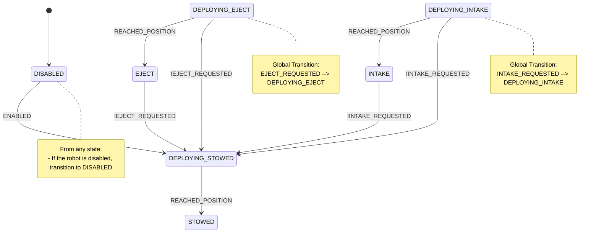

```mermaid
stateDiagram-v2

    %%disabled/DEPLOYING_STOWED
    [*] --> DISABLED
    DISABLED --> DEPLOYING_STOWED : ENABLED

    %%stowing
    DEPLOYING_STOWED --> STOWED : REACHED_POSITION

    %%eject
    DEPLOYING_EJECT --> EJECT : REACHED_POSITION
    DEPLOYING_EJECT --> DEPLOYING_STOWED : !EJECT_REQUESTED
    EJECT --> DEPLOYING_STOWED : !EJECT_REQUESTED

    note right of DEPLOYING_EJECT
        Global Transition:
        EJECT_REQUESTED --> DEPLOYING_EJECT
    end note

    %% intake
    DEPLOYING_INTAKE --> INTAKE : REACHED_POSITION
    DEPLOYING_INTAKE --> DEPLOYING_STOWED : !INTAKE_REQUESTED
    INTAKE --> DEPLOYING_STOWED : !INTAKE_REQUESTED

    note right of DEPLOYING_INTAKE
        Global Transition:
        INTAKE_REQUESTED --> DEPLOYING_INTAKE
    end note

    note right of DISABLED
        From any state:
        - If the robot is disabled, transition to DISABLED
    end note
```
